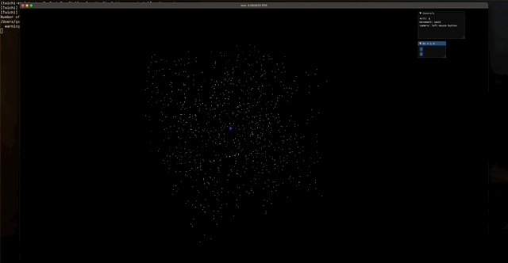

 #Galactic Centre Simulation

 This projects is a GPU accelerated n-body, Newtonian gravity simulation. It is build using Taichi in Python.

 

#Requirements

 - Python >=3.7, <=3.11 
 - taichi
 - numpy

 - install numpy and taichi with
```sh
  pip install -r requirements.txt
  ```
  you will have to have installed a version of python within the above range

 #Installation and Usage

 ###Clone the repo
```sh
git clone https://github.com/Gosewinckel/Stellar_Gravity_Simulation
cd diabetes_tracker
```

 ###Create a virtual environment in python 3.11
 set up a virtual environment in python 3.11
```sh
python3.11 -m venv taichi-env
```
 then activate it 
 mac/linux:
```sh
source taichi-env/bin/activate
```

 ###Run the simulation
```sh
python main.py
```

 #Assumptions and Approximations
 I have made a lot of assumptions and approximations in the development of this simulation so that a desktop can handle the processing, I will list them here.
 - Newtonian universe
 - Frictionless universe
 - increments of time are 0.165 years at dt=1
 - Used Verlet integration to calculate differential equations
 - Stars immediately appear with random properties


